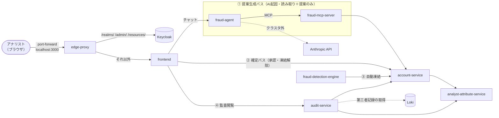
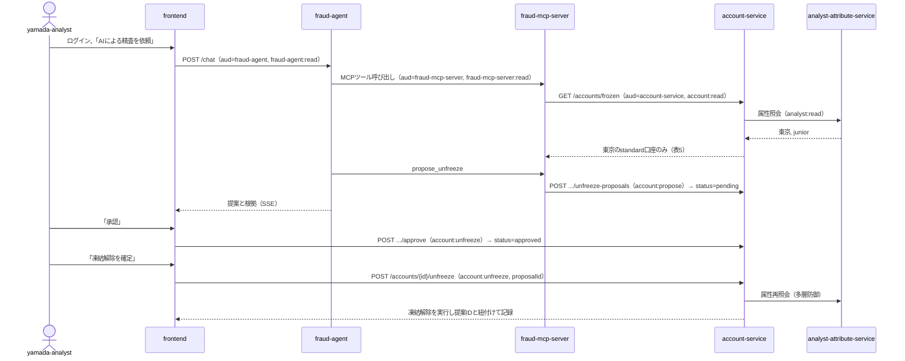

# アーキテクチャ設計

本ドキュメントは**現在有効な**アーキテクチャの断面を記録する。業務要件をどう実現するかのディシジョンテーブル（§6）、実行時シナリオ（§10）、既知の制約・未着手事項（§11）も含む。

- 何を・なぜ実現するか（目的・背景・要求水準、業務要件BR0〜BR11）：[requirements.md](requirements.md)
- 個々の設計判断の根拠・選択経緯：[docs/adr/](adr/)（[テーマ別索引](adr/README.md)）
- 各サービスの存在意義・提供機能・保有データ：[services.md](services.md)
- 実装・実機検証で見つかった罠：[insights.md](insights.md)

決定が変わった場合は本書の該当箇所を直接書き換え、経緯は新しいADRに書く（運用ルールは[CLAUDE.md](../CLAUDE.md)）。

## 1. 採用する認可サーバー

**Keycloak 26.7.0**（realm名`gekko`）を使用する。realm定義は[k8s/keycloak/realm-configmap.yaml](../k8s/keycloak/realm-configmap.yaml)。Token ExchangeはKeycloakのStandard Token Exchange V2（RFC 8693、Impersonation方式）を使う。

トークンのクレームに含めるデータと、業務サービス側に外部化して都度照会するデータの切り分けは、役割（委譲の天井か実行時の個別業務判断か）・オーナーシップ・機密性の3軸で判断する（[ADR 0006](adr/0006-claim-vs-external-attribute-criteria.md)）。この基準の具体的な適用例は§6「認証」節を参照。

## 2. シナリオとサービス構成

金融の不正検知・口座凍結解除（[ADR 0011](adr/0011-scenario-ai-assisted-unfreeze.md)。精緻化は[ADR 0036](adr/0036-unfreeze-proposal-approval-step.md)・[ADR 0039](adr/0039-unfreeze-recommendation-axis.md)）。自動検知エンジンが口座を凍結し、AIエージェントが凍結の妥当性を分析して解除を提案し、アナリストが承認・確定して初めて解除される。監査サービスが事後にその記録を第三者記録と突合する。



図では省略しているが、トークンを取得する全サービスはKeycloakのトークンエンドポイントへ、DBを持つサービス（Keycloak・account-service・analyst-attribute-service・fraud-detection-engine）は共有Postgres（§8）へ接続する。①〜④は§5のトークンチェーンに対応する。

| サービス | 役割 | 言語 / フレームワーク |
|---|---|---|
| frontend | アナリスト向けBFF。ログイン・ダッシュボード・チャット・監査画面 | TypeScript / Nuxt.js |
| fraud-agent | AIエージェント。凍結理由を分析し解除を提案する（実行権限なし） | TypeScript / Claude Agent SDK |
| fraud-mcp-server | account-serviceの読み取り・提案系機能をMCPツールとして公開する | Python / FastMCP |
| account-service | 口座・取引・凍結・提案を保有し、アナリスト属性に基づくアクセス制御を行う | Java / Spring Boot |
| analyst-attribute-service | アナリストの担当地域・権限レベルを保有する（委任チェーンの終端） | Go（標準ライブラリ） |
| fraud-detection-engine | 取引パターンを監視し口座を自動凍結する（機械間認証） | Rust / Axum |
| audit-service | account-serviceの自己申告とKeycloak/Envoyの第三者記録を突合する | Go（標準ライブラリ） |

詳細は[services.md](services.md)、言語選定の理由は[ADR 0007](adr/0007-per-service-language-selection.md)を参照。

## 3. Token Exchangeの実装方式とサイドカー構成

**Token Exchangeは各サービスのEnvoyサイドカーから呼ばれるext_authzサービスとして実装する**（[ADR 0002](adr/0002-token-exchange-in-envoy-sidecar.md)）。アプリケーション本体にはToken Exchangeのコードを一切持たせない。

### 3.1 Podの構成

各サービスのPodは次のコンテナで構成する（edge-proxyのみEnvoy単体Pod）。

| コンテナ | 種別 | 役割 | 置かれるサービス |
|---|---|---|---|
| `handshake-init` | initContainer | バイパス防止用の使い捨て合言葉を生成し、emptyDirで共有する（§3.4） | ingressを持つ全サービス（fraud-detection-engine・Keycloak以外） |
| `envoy` | ネイティブsidecar（`initContainers`の`restartPolicy: Always`） | ingress（JWT検証・scope検証）、egress（ext_authz経由のToken Exchange）、SPIRE mTLS | 全サービス |
| `wait-for-postgres` | initContainer | appコンテナの起動をPostgres疎通確認後まで遅らせる（[ADR 0028](adr/0028-postgres-mtls-tcp-proxy.md)） | Keycloak・account-service・analyst-attribute-service・fraud-detection-engine |
| `app` | コンテナ | アプリ本体。`127.0.0.1`にのみbindする | 全サービス |
| `token-exchange` / `client-credentials` / `egress-auth` | コンテナ | ext_authzサービス本体。SPIRE発行JWT-SVIDでKeycloakにクライアント認証し、Token Exchange（または client_credentials）を実行する（[ADR 0019](adr/0019-ext-authz-identity-gap-and-spiffe-jwt-svid-auth.md)・[ADR 0020](adr/0020-fraud-detection-engine-identity-gap-and-client-credentials-federated-jwt.md)） | 次ホップへ委任するサービス（`client-credentials`はfraud-detection-engine、`egress-auth`は両グラントを使い分けるaudit-service） |

### 3.2 egress：宛先・audience・scopeの決め方

- アプリは相手サービスの**実サービス名・実APIパスをそのまま**使ってリクエストを組み立てる（例：`http://account-service/accounts/123/transactions`）。人工的なURLプレフィックスやegress専用ポートは使わない。Podの`hostAliases`で相手サービス名を`127.0.0.1`へ静的にマッピングし、Envoyが1つのリスナー上の複数`virtual_hosts`（`domains`でサービス名をマッチ）で受け、`ext_authz`（HTTPモード）フィルタが横取りしてToken Exchangeを実行してから実際のアップストリームへ転送する（[ADR 0010](adr/0010-egress-listener-granularity.md)）
- **audienceはHostヘッダーから自動導出する**。Keycloakクライアントid＝Kubernetes Service名＝audience名を常に同一の文字列にする（MUST）ため、ext_authzサービスはCheckRequestに自動転送される`Host`ヘッダーをそのまま`audience`として使える
- **scopeは「相手サービスの(パス, メソッド) → scope」という単一の対応表で決める**（§6表2。account-service自身のingress側rbacポリシーと共有する単一の情報源）。この対応表はext_authzサービス自身がコード（`SCOPE_RULES`）として持つ。HTTPモードのext_authzは`Host`・`Method`・`Path`・`Content-Length`・`Authorization`を常に自動転送するため（`ExtAuthzPerRoute`の`context_extensions`はgRPCモード限定で使えない。[insights.md](insights.md)参照）、Envoy側のroute設定は転送先クラスタの振り分けだけを担う。scopeが1つしかないホップは、この対応表がワイルドカード1行になっているだけで、特別扱いはない
- ext_authzの応答から`Authorization`ヘッダーを上流へ引き継ぐため、`allowed_upstream_headers`に`Authorization`を含める
- Keycloak側の前提：Token Exchangeの`audience`が解決されるには、要求元クライアントに割り当てたclient scopeが対象audienceを指す`oidc-audience-mapper`を持っている必要があり、持っていないaudienceへの要求はKeycloak自身が`Requested audience not available`で拒否する（[insights.md](insights.md)参照）。各client scopeは対象audienceを1つだけ持つ（[ADR 0046](adr/0046-account-read-audience-scope-split.md)）。この対応は`optionalClientScopes`の割当のみで表現され、Keycloakの許可判定自体がトポロジー制御を兼ねる

### 3.3 ホップ一覧

Token Exchange/client_credentialsが動作するホップは次の9つ。全ホップで、トークン取得の実行主体は呼び出し元自身のPod内サイドカーであり、Keycloakへのクライアント認証はSPIRE発行JWT-SVID（Keycloakの`federated-jwt`）で行う。

| # | 呼び出し元 → 宛先 | グラント | scope | ADR |
|---|---|---|---|---|
| 1 | frontend → account-service | Token Exchange | `account:read`（GET）／`account:unfreeze`（承認・却下・凍結解除のPOST） | [0024](adr/0024-frontend-edge-proxy-and-simplified-login.md)・[0036](adr/0036-unfreeze-proposal-approval-step.md) |
| 2 | frontend → fraud-agent | Token Exchange | `fraud-agent:read` | [0014](adr/0014-fraud-agent-token-exchange.md)・[0024](adr/0024-frontend-edge-proxy-and-simplified-login.md)・[0046](adr/0046-account-read-audience-scope-split.md)・[0047](adr/0047-fraud-agent-scope-rename.md) |
| 3 | frontend → audit-service | Token Exchange | `audit:read` | [0042](adr/0042-audit-service-senior-gate.md) |
| 4 | fraud-agent → fraud-mcp-server | Token Exchange | `fraud-mcp-server:read` | [0014](adr/0014-fraud-agent-token-exchange.md)・[0023](adr/0023-fraud-agent-fraud-mcp-server-hop.md)・[0046](adr/0046-account-read-audience-scope-split.md) |
| 5 | fraud-mcp-server → account-service | Token Exchange | `account:read`（GET）／`account:propose`（提案のPOST） | [0019](adr/0019-ext-authz-identity-gap-and-spiffe-jwt-svid-auth.md) |
| 6 | account-service → analyst-attribute-service | Token Exchange | `analyst:read` | [0021](adr/0021-account-service-analyst-attribute-service-spiffe-jwt-svid.md) |
| 7 | audit-service → analyst-attribute-service | Token Exchange | `analyst:read` | [0042](adr/0042-audit-service-senior-gate.md) |
| 8 | fraud-detection-engine → account-service | client_credentials | `account:freeze` | [0020](adr/0020-fraud-detection-engine-identity-gap-and-client-credentials-federated-jwt.md) |
| 9 | audit-service → account-service | client_credentials | `account:audit` | [0041](adr/0041-audit-service-implementation.md) |

OAuthの委任チェーンに参加しない接続が2つある。

- **fraud-agent → Anthropic API**：Keycloak登録済みのaudienceではない、メッシュ外の公開エンドポイント。appは内部専用の別名（`anthropic-gateway`、`ANTHROPIC_BASE_URL`環境変数で指定）へ接続し、Envoyが公開CA検証のTLSで`api.anthropic.com`へ再接続する（[ADR 0030](adr/0030-fraud-agent-implementation.md)）。LLM呼び出しの実行時間が不定長なため、このルートは`timeout: 0s`＋`idle_timeout: 300s`にしている（[ADR 0038](adr/0038-fraud-agent-anthropic-route-timeout.md)）
- **audit-service → Loki**：第三者記録（Keycloakイベントログ・Envoyアクセスログ）の取得元。OAuth/mTLSのメッシュには参加せず、NetworkPolicyのみで到達を制御する（[ADR 0041](adr/0041-audit-service-implementation.md)）

各ホップの実装は`k8s/<サービス名>/`配下（envoy-configmap.yaml・\*-app-configmap.yaml）。end-to-endの流れは§10、実行可能な検証は`scripts/verify-hop.sh`（audit-serviceは`scripts/verify-audit-service.sh`）を参照。

### 3.4 ingress：受信側の責務

[ADR 0009](adr/0009-envoy-ingress-responsibility-and-bypass-prevention.md)。

- JWT検証（`jwt_authn`フィルタ：署名・`iss`・`exp`・`aud`がこのサービス自身であること）とscope検証（`rbac`フィルタ：§6表2）はEnvoy側で完結させる。表5等の業務データに依存する認可判定はアプリ内に置く（理由は[ADR 0006](adr/0006-claim-vs-external-attribute-criteria.md)）
- 検証済みの身元は`jwt_authn`の`claim_to_headers`でヘッダー（`x-auth-sub`・`x-auth-scope`・`x-auth-jti`）に変換してアプリへ転送する。アプリは自前のJWTライブラリを持たない
- **Envoyを経由しない直接アクセスのバイパス防止**（3層）：
  1. アプリは`127.0.0.1`にのみbindし、ServiceはアプリのポートではなくEnvoyのリスナーを指す（構造的な防止）
  2. アプリ自身も接続元がloopbackでなければ拒否する（多層防御）
  3. `handshake-init`が生成した使い捨ての合言葉を、jwt_authn/rbacを通過した後にのみEnvoyが`x-gekko-handshake`ヘッダーとして付与し（`envoy.filters.http.lua`をrbacより後段に配置）、アプリはこれを検証してから他の認証ヘッダーを信用する（Envoyの設定ミスによるバイパスの検知）。合言葉ファイルのパスは全言語共通で環境変数`HANDSHAKE_TOKEN_FILE`から読む
- 上記2・3の検証ロジックはk8s環境外でもテスト可能にする。ただし「テスト時は検証をスキップする」条件分岐は作らない（[CWE-489](https://cwe.mitre.org/data/definitions/489.html)）。検証ロジックは環境によらず単一とし、期待値の読み出し元（ファイルパス等）のみ環境変数で設定可能にする

### 3.5 mTLS（ワークロードID）

OAuth Token Exchangeは「誰が何をしてよいか」という業務認可層であり、「誰と話しているか」という通信路の身元検証・暗号化とは独立の関心事である。後者はSPIFFE/SPIREが発行するX.509-SVIDによるmTLSで担う（[ADR 0012](adr/0012-spiffe-spire-mtls-single-hop.md)・[ADR 0015](adr/0015-dpop-removal-and-fraud-detection-engine-mtls.md)・[ADR 0017](adr/0017-edge-proxy-full-keycloak-mtls.md)・[ADR 0028](adr/0028-postgres-mtls-tcp-proxy.md)、`k8s/spire/`）。

- SPIRE agentのWorkload API（UDS）をEnvoyのSDSが参照し、証明書のプロビジョニング・ローテーションはSPIREが自動で行う。Envoy bootstrap設定・アプリ本体のどちらにも証明書のライフサイクル管理コードは現れない
- HTTPのホップはmTLS＋ALPNネゴシエーションのHTTP/2で接続する。各サービスのingressリスナーはmTLS必須のfilter_chainのみで構成し、plaintextでの到達経路は存在しない
- 受信側は`match_typed_subject_alt_names`で呼び出し元のSPIFFE ID（`spiffe://gekko.internal/ns/gekko/sa/default/<名前>`）を限定する

| 受信側 | mTLSで受け入れる呼び出し元 |
|---|---|
| account-service | fraud-mcp-server・fraud-detection-engine・frontend・audit-service |
| analyst-attribute-service | account-service・audit-service |
| fraud-mcp-server | fraud-agent |
| fraud-agent | frontend |
| audit-service | frontend |
| frontend | edge-proxy |
| Keycloak | edge-proxy、およびトークンエンドポイント・JWKSを呼ぶ各サービス |
| Postgres（Envoyのtcp_proxy、ポート6432） | Keycloak・account-service・analyst-attribute-service・fraud-detection-engine、および5つのdb-init/seed Job |

Postgres本体の平文ポート5432への直接到達経路（NetworkPolicyの許可ルール・Serviceのポート）は存在しない。

メッシュ外の接続（fraud-agent→Anthropic API、audit-service→Loki）は上記の対象外（§3.3）。

Keycloakが検証するクライアントの身元（JWT-SVID）と、そのクライアントが主張する`client_id`は全クライアントで一致する（[ADR 0019](adr/0019-ext-authz-identity-gap-and-spiffe-jwt-svid-auth.md)・[ADR 0020](adr/0020-fraud-detection-engine-identity-gap-and-client-credentials-federated-jwt.md)・[ADR 0021](adr/0021-account-service-analyst-attribute-service-spiffe-jwt-svid.md)）。

送信者拘束（DPoP、RFC 9449）・証明書拘束アクセストークン（RFC 8705）は採用していない。理由は、Impersonation方式の多段Token Exchangeでは、クライアントをまたいで拘束済みトークンを安全に再拘束するための一般的な意味づけ（semantics）がどの仕様にも定義されていないためである——RFC 8693はトークンのPoP特性を明示的にscope外とし（`actor_token`/`may_act`によるactor独立認可＝Delegationの余地は残す）、RFC 9449はDPoPをトークンリクエスト一般に適用できるとしつつclient/actorをまたぐ既存拘束の継承・再拘束は規定していない。**いずれの仕様も拒否を義務づけているわけではない**が、Impersonation下では安全な再拘束の根拠が無いため、認可サーバーは安全側に倒し、送信者拘束は再exchangeされない終端ホップにしか適用できない。その範囲の大部分は既にmTLSが守っている。詳細な論証・実機検証の根拠は[ADR 0048](adr/0048-sender-constraining-terminal-hop-only.md)（DPoP試験導入・撤去の経緯は[ADR 0013](adr/0013-dpop-sender-constraining.md)・[ADR 0015](adr/0015-dpop-removal-and-fraud-detection-engine-mtls.md)）。再検討時の実機の判断材料は[insights.md](insights.md) §5、未決の問いは§11を参照。

### 3.6 NetworkPolicy（L3/4のdefault-deny）

業務認可・mTLSとは独立な3層目として、`gekko` namespace全体にingress/egress双方向のdefault-denyを置き、実装済みの接続経路のみを明示的に許可する（[ADR 0018](adr/0018-network-policy-default-deny.md)、`k8s/*/networkpolicy.yaml`）。`observability` namespaceも同様にdefault-denyにしている。

- `spire` namespace（hostNetworkで動くspire-agent等）は対象外（§11参照）
- Keycloakのkubelet向けhttp-mgmt（9000）はexecプローブ化し`KC_HTTP_MANAGEMENT_HOST=127.0.0.1`に限定しているため、ネットワーク経由では誰からも到達できない（[ADR 0022](adr/0022-keycloak-mgmt-probe-exec.md)）
- fraud-agentのみ、Anthropic API向けにpodSelectorで宛先を特定できない公開インターネットegress（`ipBlock 0.0.0.0/0`からRFC1918プライベートレンジを除外した範囲、port 443のみ）を許可している（[ADR 0030](adr/0030-fraud-agent-implementation.md)）

## 4. Keycloakのクライアント・スコープ設計

**クライアント**

全ての要求元クライアントはconfidential clientで、クライアント認証はSPIRE発行JWT-SVID（`federated-jwt`）で行う（client secretは持たない）。

| クライアント | グラント | 備考 |
|---|---|---|
| `frontend` | Authorization Code + PKCE、Token Exchange | アナリスト向けBFF（[ADR 0031](adr/0031-frontend-implementation.md)） |
| `fraud-agent` | Token Exchange | frontendから受け取ったトークンをfraud-mcp-server宛てに再exchangeする（[ADR 0014](adr/0014-fraud-agent-token-exchange.md)・[ADR 0046](adr/0046-account-read-audience-scope-split.md)） |
| `fraud-mcp-server` | Token Exchange | AIエージェントの代理としてaccount-serviceを呼ぶ |
| `account-service` | Token Exchange | analyst-attribute-serviceへの委任元 |
| `fraud-detection-engine` | client_credentials | 機械間認証。ユーザー委任なし |
| `audit-service` | client_credentials、Token Exchange | account-serviceへは機械間認証、analyst-attribute-serviceへはfrontendから委任されたアナリストとしてToken Exchangeで照会する（[ADR 0041](adr/0041-audit-service-implementation.md)・[ADR 0042](adr/0042-audit-service-senior-gate.md)） |
| `analyst-attribute-service` | なし | audience名としてのみ存在する（自身はトークンを要求しない） |

全てのトークンは常に単一のaudienceのみを持つ（[ADR 0005](adr/0005-single-audience-tokens-only.md)）。ログイントークンは`aud=frontend`のみで、`account:read`等のスコープは持たない（§6「認証」）。frontendが他サービスを呼ぶ際は、都度明示的なToken Exchangeで単一audienceのトークンを取得する（§5）。

**スコープとトポロジー制御**（各クライアントに付与するoptional client scopeのみで委任トポロジーを制御する。Client Policiesは使わない）

| スコープ | 対象audience | 付与するクライアント | 意味 |
|---|---|---|---|
| `account:read` | account-service | frontend, fraud-mcp-server | 取引・口座の読み取り |
| `fraud-agent:read` | fraud-agent | **frontend のみ** | AIエージェントとのチャット開始（委任チェーンの入口。[ADR 0014](adr/0014-fraud-agent-token-exchange.md)・[ADR 0046](adr/0046-account-read-audience-scope-split.md)・[ADR 0047](adr/0047-fraud-agent-scope-rename.md)） |
| `fraud-mcp-server:read` | fraud-mcp-server | **fraud-agent のみ** | MCPツール呼び出し（[ADR 0014](adr/0014-fraud-agent-token-exchange.md)・[ADR 0046](adr/0046-account-read-audience-scope-split.md)） |
| `account:propose` | account-service | **fraud-mcp-server のみ** | 凍結解除案の記録（可逆・低リスク） |
| `account:freeze` | account-service | **fraud-detection-engine のみ** | 口座凍結の自動実行（機械間認証。業務属性チェックなし） |
| `account:unfreeze` | account-service | **frontend のみ** | 凍結解除提案の承認・却下、口座凍結の解除の実行（不可逆・高リスク） |
| `account:audit` | account-service | **audit-service のみ** | 凍結解除の自己申告記録（承認・実行）の読み取り（機械間認証。[ADR 0040](adr/0040-audit-service-reconciliation.md)・[ADR 0041](adr/0041-audit-service-implementation.md)） |
| `analyst:read` | analyst-attribute-service | account-service, audit-service | アナリストの担当地域・権限レベル照会 |
| `audit:read` | audit-service | **frontend のみ** | 監査（自己申告と第三者記録の突合結果）の閲覧。senior限定の判定はaudit-service側で行う（[ADR 0042](adr/0042-audit-service-senior-gate.md)） |

`account:unfreeze`は`fraud-mcp-server`にも`fraud-agent`にも一切付与しない。AIエージェントがどれだけ「解除すべき」と提案しても、Keycloakのスコープ設計上そもそも凍結解除APIを呼べるトークンを取得できない、という形で認可レイヤーで強制する（§6表1・表2）。

## 5. トークンチェーン

ログイントークン（`aud=frontend`）を起点に、目的ごとに異なる単一audienceトークンを都度Token Exchangeで取得する（[ADR 0005](adr/0005-single-audience-tokens-only.md)）。frontendが「ログイントークンをそのまま使う近道」は存在しない。

**① 提案生成パス（AI起因、読み取り＋提案のみ）**
```
analystトークン(aud=frontend)
  → Token Exchange (frontend実行, audience=fraud-agent, scope=fraud-agent:read)
  → Token Exchange (fraud-agent実行, audience=fraud-mcp-server, scope=fraud-mcp-server:read)
  → Token Exchange (fraud-mcp-server実行, audience=account-service, scope=account:read または account:propose)
  → account-serviceがToken Exchange (audience=analyst-attribute-service, scope=analyst:read) でアクセス制御
```

**② 確定パス（人間起因、決定論的操作）**
```
analystトークン(aud=frontend)
  → Token Exchange (frontend実行, audience=account-service, scope=account:unfreeze)
  → 提案の承認/却下（依頼者本人のみ。BR9）、または凍結解除の実行
  → いずれもaccount-serviceが同じくanalyst-attribute-serviceへ照会（提案生成パスと同じ判定ロジック）
  → 凍結解除の実行は、①で記録され承認された提案IDと紐付けて記録
```

**③ 自動凍結パス（機械間、業務属性チェック対象外）**
```
fraud-detection-engineの client_credentials トークン(scope=account:freeze)
  → account-serviceが通常のスコープチェックのみで処理（analyst-attribute-serviceへの照会は発生しない）
```

**④ 監査閲覧パス（人間起因、senior限定。[ADR 0042](adr/0042-audit-service-senior-gate.md)）**
```
analystトークン(aud=frontend)
  → Token Exchange (frontend実行, audience=audit-service, scope=audit:read)
  → audit-serviceがToken Exchange (audience=analyst-attribute-service, scope=analyst:read) で
    levelを照会し、senior以外は403で拒否する（表5のABAC判定とは別軸の二値ゲート。
    地域/ティアによる絞り込みは行わない）
  → 通過した場合、audit-serviceは別途client_credentials(scope=account:audit)で
    account-serviceの自己申告を取得し、Lokiの第三者記録と突合して返す
```

`sub`は①②④を通じて常に元のanalystのまま維持される（Impersonation方式）ため、「AIが何を見て何を提案したか」と「人間が何を確定したか」を同一`sub`かつ異なる`jti`/`scope`で追跡でき、監査で再構成できる（§9）。①②④はいずれもfrontendが自身のログイントークンを`subject_token`として実行する別々のToken Exchangeの結果であり、1つのトークンが複数の用途を兼ねることはない。

## 6. 認可のディシジョンテーブル

[requirements.md](requirements.md)「業務要件（アクセス制御）」で定めた業務要件（BR0〜BR11）を、§3〜§5の認可設計がどう実現しているかを、条件と結果が漏れなく列挙できる形（ディシジョンテーブル）で示す。各表の見出しに対応する要件番号を明記する。要件→表の対応一覧は[requirements.md](requirements.md)「architecture.mdとの対応」を参照。

### 認証（アナリストのログイントークン、BR0に対応）

以降の表は全て「認証済みの主体が保持するトークン」を前提にしている。BR0（認証の必須化）は、ここで発行されるログイントークンを持たない限り以降のどのToken Exchangeも開始できない、という形で実現される。

アナリストはOAuth 2.0 Authorization Code + PKCEでKeycloakにログインする（コールバックは`response_mode=form_post`。[ADR 0031](adr/0031-frontend-implementation.md)・[ADR 0032](adr/0032-frontend-oidc-callback-form-post.md)）。frontendはconfidential clientとして、受け取ったauthorization codeをKeycloakのトークンエンドポイントでアクセストークンに交換する（通常のOIDC認可コードフローであり、Token Exchangeではない）。

ここで発行される**ログイントークン**の内容は以下の通り。

| クレーム | 値 |
|---|---|
| `sub` | アナリストの一意識別子（uid）。以降の全てのToken Exchangeを通じて維持され、委任チェーン全体を追跡するキーになる |
| `preferred_username` | アナリストがログインに使った読める名前（例: `yamada-analyst`）。id_tokenのみに含まれ、画面表示等の人間可読な用途にのみ使う（[ADR 0034](adr/0034-frontend-display-username-instead-of-sub.md)） |
| `aud` | `frontend`（単一。[ADR 0005](adr/0005-single-audience-tokens-only.md)） |
| `iss` | Keycloakのrealm発行者 |
| scope | 最小限（`openid`程度）。`account:read`・`account:unfreeze`等のスコープはこの時点では一切持たない |

このトークンには、アナリストの担当地域・権限レベルは一切含まれない。これらはanalyst-attribute-serviceが保持する外部属性であり、必要になった都度、後続のToken Exchangeの先で照会される（表5）。担当地域・権限レベルは[ADR 0006](adr/0006-claim-vs-external-attribute-criteria.md)の3軸全てで「外部化すべき」側に該当する：実行時の個別業務判断（今このアナリストが何をできるか）のもとになるデータであり、正典は業務ドメイン（人事上の配属情報）であり、fraud-mcp-server等の中継者に見せる必要がないため。

このログイントークンをそのままaccount-service等の呼び出しに使う経路は存在しない。frontendが目的別に明示的なToken Exchangeを実行する（表1、§5）。ログイントークンを送信者拘束するかどうかは未決定（§11参照）。

### 表1: Audience間のToken Exchange可否（BR4・BR5・BR6・BR11に対応）

行は交換前トークンの`aud`（元audience）、列は交換後に要求する`aud`（先audience）である。全てのトークンは単一のaudienceのみを持つため、「元audience」は常に一意に定まる。client_credentials（fraud-detection-engine、audit-service→account-service）はToken Exchangeに参加しないため、この表には含めない（表4）。

| 元audience \ 先audience | account-service | fraud-agent | fraud-mcp-server | analyst-attribute-service | audit-service |
|---|---|---|---|---|---|
| frontend | ALLOW | ALLOW | DENY | DENY | ALLOW |
| fraud-agent | DENY | — | ALLOW | DENY | DENY |
| fraud-mcp-server | ALLOW | DENY | — | DENY | DENY |
| account-service | — | DENY | DENY | ALLOW | DENY |
| audit-service | DENY | DENY | DENY | ALLOW | — |
| analyst-attribute-service | DENY | DENY | DENY | DENY | DENY |

- ALLOWは6マス。frontendの行に3つALLOWがあるのは、frontendが1つのログイントークンから、目的の異なる単一audienceトークン（account-service向け・fraud-agent向け・audit-service向け）をそれぞれ個別のToken Exchangeで取得するため。1つのトークンが複数audienceを同時に持つわけではない
- AIエージェント側の委任チェーンはfrontend→fraud-agent→fraud-mcp-server→account-serviceの4ホップ（[ADR 0014](adr/0014-fraud-agent-token-exchange.md)）。各ホップは常に自分宛て（`aud`が自分自身のクライアントidと一致する）トークンだけを`subject_token`として次のToken Exchangeに使う
- AIエージェント側の経路からanalyst-attribute-serviceへ到達する手段は、account-serviceを経由するものだけである。ホップ飛ばし（例：fraud-agentが直接account-serviceやanalyst-attribute-serviceを呼ぶ）は構造上不可能（各クライアントへの`optionalClientScopes`の割当のみで実現）
- frontend→fraud-agentの交換で発行されるトークンは`fraud-agent:read`のみ、fraud-agent→fraud-mcp-serverの交換で発行されるトークンは`fraud-mcp-server:read`のみを持ち、いずれも`account:unfreeze`は含まれない。これがAIエージェントに凍結解除の実行権限を渡さないための核心の仕組み（表2参照）

**この表の読み方の前提（重要）**：

- Keycloakの実際の許可判定は「トークンのaudienceそのもの」ではなく、「Token Exchangeを要求しているクライアント自身（JWT-SVIDで認証された`client_id`）が、要求先audienceについて許可されているか」、かつ「提示された`subject_token`の`aud`に、その要求元クライアント自身が含まれているか」の2点で行われる。本システムではaudience名とKeycloakのクライアントidを同一にし、かつ各サービスは自分宛てのトークンしか受け取らないため、「元audience」と「それを正当に提示できる唯一のクライアント」が1対1に対応する。だからこそ本表を「audience→audience」の単純な遷移表として記述できる。この前提（audience名＝client id、1トークン1保持者）が崩れる場合、この単純化は成立しない
- この表は「どのaudience間でToken Exchangeが許可されているか」という認可トポロジーを示すものであり、「そのトークンを提示しているプロセスが本当に正当な保持者か」は別の関心事である。ベアラートークンである以上、盗まれたトークン文字列は誰でも提示できる。これを防ぐ送信者拘束（DPoP等）は採用しておらず、通信路の身元検証はmTLS（§3.5）が担う（§11参照）
- 表1のDENYは、各client scopeが対象audienceのマッパーを1つだけ持つこと（前記「この表の読み方の前提」参照）によってKeycloak自身が強制する。要求元クライアントが割り当てられたscopeで持たないaudienceを要求しても、Keycloakが`Requested audience not available`で拒否する（[ADR 0046](adr/0046-account-read-audience-scope-split.md)、[insights.md](insights.md)参照）

### 表2: account-serviceのスコープ別操作可否（BR5・BR6・BR9に対応）

パスパターンは、account-service自身のingress側rbacポリシー（[k8s/account-service/envoy-configmap.yaml](../k8s/account-service/envoy-configmap.yaml)）と、account-serviceを呼ぶ全ての呼び出し元のegress側scope解決（`SCOPE_RULES`）の両方が参照する単一の情報源である。パスを追加・変更する場合は両方を同時に更新する（[insights.md](insights.md)参照）。

| 操作 | 必要スコープ | パスパターン |
|---|---|---|
| 取引履歴・凍結中口座の照会（read） | `account:read` | `GET /accounts/**`（`/accounts/frozen`・`/accounts/{id}/transactions`を含む、読み取り系は全てこの配下） |
| 凍結解除案の記録（propose） | `account:propose` | `POST /accounts/{id}/unfreeze-proposals` |
| 口座凍結の自動実行（freeze） | `account:freeze`（機械間認証。業務属性チェックなし。表4参照） | `POST /accounts/{id}/freeze` |
| 凍結解除提案の承認・却下（decide） | `account:unfreeze`（提案を依頼した本人アナリストのみ。BR9・[ADR 0036](adr/0036-unfreeze-proposal-approval-step.md)） | `POST /accounts/{id}/unfreeze-proposals/{proposalId}/approve`, `.../reject` |
| 口座凍結の解除の実行（unfreeze） | `account:unfreeze`（実行時にanalyst-attribute-serviceへの再照会あり。表5参照。提案経由の場合は承認済み・依頼者本人・AIの結論が`unfreeze`であることも検証） | `POST /accounts/{id}/unfreeze` |
| 自己申告記録の読み取り（audit） | `account:audit`（機械間認証。表4参照） | `GET /audit/**`（`/audit/unfreeze-proposals`・`/audit/unfreeze-executions`） |

#### どのトークンがどのスコープを保有するか

§4のクライアント別スコープ割当を前提に、実際に発生する交換パスごとにトークンが保有しうるスコープを列挙したものが以下の表である。サイドカーは1回のToken Exchangeでリクエストの(パス, メソッド)から解決したscopeを1つだけ要求するため、個々のトークンが持つscopeは常に1つである。

| トークン | 発行経路 | 保有しうるスコープ |
|---|---|---|
| frontendが発行するトークン（account-service宛て） | frontendがログイントークンを`subject_token`にToken Exchange | `account:read`（ダッシュボード表示）または`account:unfreeze`（承認・却下・凍結解除） |
| frontendが発行するトークン（fraud-agent宛て、提案生成パス用） | 同上、target audienceのみ異なる（[ADR 0014](adr/0014-fraud-agent-token-exchange.md)・[ADR 0046](adr/0046-account-read-audience-scope-split.md)・[ADR 0047](adr/0047-fraud-agent-scope-rename.md)） | `fraud-agent:read`のみ |
| frontendが発行するトークン（audit-service宛て、監査閲覧用） | 同上（[ADR 0042](adr/0042-audit-service-senior-gate.md)） | `audit:read`のみ |
| fraud-agentが発行するトークン（fraud-mcp-server宛て） | fraud-agentが受け取った`aud=fraud-agent`のトークンを`subject_token`にToken Exchange（[ADR 0046](adr/0046-account-read-audience-scope-split.md)） | `fraud-mcp-server:read`のみ |
| fraud-mcp-serverが発行するトークン（account-service宛て） | fraud-mcp-serverがToken Exchange | `account:read`または`account:propose` |
| fraud-detection-engineのclient_credentialsトークン | client_credentials（委任チェーン外） | `account:freeze`のみ |
| audit-serviceのclient_credentialsトークン | client_credentials（委任チェーン外） | `account:audit`のみ |

fraud-agent・fraud-mcp-server（ひいてはAIエージェント）が`account:unfreeze`を持つ経路は存在しない。凍結解除の実行、および提案の承認・却下のいずれも、frontendが確定パス用に発行するトークンのみで到達可能であり、これはアナリストがUIで決定論的操作（承認/却下ボタン、「凍結解除を確定」ボタン）を行った場合にのみ発行・使用される。

#### scopeチェックの実施箇所（MUST）

この表のスコープチェックは、**Envoyサイドカーの受信側（アプリの外）で行うか、やむを得ずアプリ内で行う場合もリクエストの入口（ハンドラの先頭、表5のABAC判定より前）でのみ**行う。ビジネスロジックの途中や、表5のABAC判定の後にスコープチェックを行ってはならない。理由は[ADR 0006](adr/0006-claim-vs-external-attribute-criteria.md)を参照。

### 表3: analyst-attribute-serviceの照会可否（BR4・BR11に対応）

AIエージェント経由の経路がanalyst-attribute-serviceへ直接到達できないことを保証する表。これにより、表5のABAC判定は必ずaccount-serviceを経由した最新の属性照会に基づいて行われ、BR4（AIエージェントの閲覧範囲はアナリスト本人を超えない）の前提が成り立つ。

| 呼び出し元 | 目的 | 照会可否 |
|---|---|---|
| account-service（`aud=account-service`のトークンを`subject_token`に交換、scope=`analyst:read`） | 表5のABAC判定（BR1〜BR4） | ALLOW |
| audit-service（`aud=audit-service`のトークンを`subject_token`に交換、scope=`analyst:read`） | 監査閲覧のsenior限定ゲート（BR11。[ADR 0042](adr/0042-audit-service-senior-gate.md)） | ALLOW |
| その他すべて | — | DENY |

いずれの呼び出し元もToken Exchangeで`sub`を元のアナリスト本人のまま維持しており、analyst-attribute-serviceは照会対象と`x-auth-sub`の一致を検証して本人以外の属性照会を拒否する。

### 表4: client_credentialsによるaccount-serviceアクセス（Token Exchange対象外、BR7に対応）

ユーザー委任チェーンに参加しない機械間認証のため、表1の委任トポロジーとは別枠で扱う。

| 呼び出し元 | スコープ | 業務属性チェック | 対応要件 |
|---|---|---|---|
| fraud-detection-engine | `account:freeze` | なし（スコープチェックのみ） | BR7 |
| audit-service | `account:audit` | なし（スコープチェックのみ。読み取り専用） | BR8の検証手段（§9） |

### 表5: account-serviceの口座別アクセス可否（アナリスト経由、RBAC+ABAC、BR1・BR2・BR3に対応）

アナリスト経由のリクエスト（`account:read`/`account:propose`/`account:unfreeze`のいずれか）にのみ適用される。表4のclient_credentialsアクセスには適用しない（BR7）。

`sub`がアナリスト本人のまま委任チェーンを通じて維持されるため（表1）、この判定はfrontend直接・AIエージェント経由のどちらのリクエストであっても同じアナリスト本人の属性に対して行われる。これによりBR4が成り立つ。

| 権限レベル \ 口座の地域・ティア | 担当地域一致・standard | 担当地域一致・high-value | 担当地域不一致 |
|---|---|---|---|
| senior | ALLOW | ALLOW | DENY |
| junior | ALLOW | DENY | DENY |
| 属性未登録 | DENY | DENY | DENY |

- 担当地域はアナリストごとに複数持てる（表6参照）
- 拒否の表現は操作種別で使い分ける（[ADR 0026](adr/0026-account-service-analyst-attribute-service-implementation.md)）：単一リソース読み取り（`GET /accounts/{id}/transactions`）は404（口座の存在自体を秘匿）、単一リソースへの操作（propose/unfreeze）は403（呼び出し元は既に口座の存在を知っている前提）、一覧（`GET /accounts/frozen`）は個別のDENYではなく**結果セットからの除外**（§10参照）
- juniorがhigh-value口座の凍結解除を試みた場合、AIエージェント経由（提案止まり）でも人間の確定操作でも、この表に従ってaccount-serviceが拒否する

### 表6: テストアナリスト

`make deploy-verify-hop`が投入する（[k8s/keycloak/test-fixtures-configmap.yaml](../k8s/keycloak/test-fixtures-configmap.yaml)・[k8s/analyst-attribute-service/seed-configmap.yaml](../k8s/analyst-attribute-service/seed-configmap.yaml)）。パスワードは`.secrets/<アナリスト名>-password`。

| アナリスト | 担当地域 | 権限レベル |
|---|---|---|
| yamada-analyst | 東京 | junior |
| suzuki-senior | 東京, 大阪 | senior |
| tanaka-junior | 大阪 | junior |

## 7. ローカル実行環境

**k3d**（[ADR 0003](adr/0003-k3d-without-istio.md)）。Istioは使わず、サイドカーは素のEnvoyを手動構成する。

- クラスタ定義は[k3d/cluster-config.yaml](../k3d/cluster-config.yaml)。単一サーバーノード、Traefik・servicelbは無効化（Ingressを使わないため）
- 外部公開はIngressではなく`kubectl port-forward`で行う（[ADR 0004](adr/0004-external-access-via-port-forward.md)）。`make keycloak-forward`がedge-proxyのServiceを`localhost:3000`へport-forwardし、edge-proxyは`/realms/`・`/admin/`・`/resources/`をKeycloakへ、それ以外をfrontendへ振り分ける（[ADR 0017](adr/0017-edge-proxy-full-keycloak-mtls.md)・[ADR 0024](adr/0024-frontend-edge-proxy-and-simplified-login.md)）。`KC_HOSTNAME`はブラウザから到達する固定URL`http://localhost:3000`に固定している
- Keycloakは`kc.sh build`済みイメージ（[services/keycloak/Dockerfile](../services/keycloak/Dockerfile)）を`start --optimized`で起動する（[ADR 0035](adr/0035-keycloak-optimized-build.md)）
- 各サービスのイメージはローカルでビルドし`k3d image import`で持ち込む（レジストリは使わない）。`make sync`は全サービスを再ビルドし、イメージIDが変わったサービスだけをrollout restartする
- クラスタのup/down/stop/start/statusは`make`タスクで操作する（[Makefile](../Makefile)、一覧は[README.md](../README.md)）
- 実行に必要なWSL2側の前提条件（cgroup v2化・メモリ上限）は[insights.md](insights.md)「k3d / WSL2」を参照

## 8. データストア

各サービスは自分のデータの唯一の番人であり、他サービスは直接テーブルを見ない（サービス境界をスコープ付きトークンで越えるという本プロジェクトの核心と矛盾するため）。ローカル環境はメモリ制約が既知（[insights.md](insights.md)）のため、エンジン自体は共有しつつサービスごとに論理DB・認証情報を分離する。詳細・選定理由は[ADR 0008](adr/0008-per-service-datastore-strategy.md)を参照。

| サービス | エンジン |
|---|---|
| account-service | PostgreSQL（専用データベース） |
| fraud-detection-engine | PostgreSQL（同一インスタンス内の別データベース） |
| analyst-attribute-service | PostgreSQL（同一インスタンス内の別データベース） |
| Keycloak（業務サービス群の外・プラットフォーム基盤） | PostgreSQL（同一インスタンス内の別データベース） |
| frontend | なし（ログインセッションは暗号化Cookieでステートレスに保持） |
| fraud-agent・fraud-mcp-server | なし（受け取った委任トークンを中継するのみ） |
| audit-service | なし（呼び出しの都度account-service・Lokiから取得して突合するのみ。[ADR 0040](adr/0040-audit-service-reconciliation.md)） |

各DBの初期化（データベース・ロール作成）は1回限りのdb-init Job、テストアナリスト属性の投入はseed Jobが行う。共有Postgresへの接続はJobを含め全てEnvoyのtcp_proxy＋mTLS配下にある（§3.5、[ADR 0028](adr/0028-postgres-mtls-tcp-proxy.md)）。

## 9. 監査

[requirements.md](requirements.md) BR8（事後追跡可能性）を満たすため、2段構えにしている。

1. **記録と集約**：account-serviceが「誰が提案し・誰がいつ承認し・誰がいつ実行したか」を自己申告として記録し、監査ログ集約基盤がKeycloak・Envoyの第三者記録を集める
2. **突合**：独立したaudit-serviceが、自己申告と第三者記録が一致するかを検証する

### 記録と集約

監査ログ集約基盤（Grafana Alloy + `grafana/otel-lgtm`、`observability` namespace、[ADR 0025](adr/0025-audit-log-aggregation.md)）で、Envoyアクセスログ・KeycloakイベントログをLokiに集約する。相関キーは次の通り。

| キー | 意味 |
|---|---|
| `sessionId` | Keycloakのログインセッションid。同一のfrontendログインセッションに由来する全ホップのToken Exchangeイベントは同じ`sessionId`を持つ（[insights.md](insights.md)参照）。`sub`（誰か）より細かく「どのログインセッションか」まで束ねるが、同一ログインセッション内で並行する複数操作（別タブ等）は同じ`sessionId`になるため、これ単体では操作単位の区別はできない。操作単位の区別自体は監査要件ではない（BR8が求める「実行がどの提案に基づくか」は`proposal_id`、「誰が実行したか」は`sub`/`jti`で決定的にたどれる）。client_credentialsグラントには`sessionId`が存在しない |
| `sub`/`userId`/`username` | 誰が。委任チェーン全体で元のアナリストのまま維持される（Impersonation方式）。client_credentialsグラントでは`sub`はそのサービス自身のサービスアカウントになる（BR7と整合） |
| `token_id`（jti）/`scope`/`audience` | 各ホップで何をしたか。ホップごとに新しいトークンが発行されるため、`jti`はホップごとに変わる |

主軸はKeycloakのイベントログ（`eventsEnabled`、`TOKEN_EXCHANGE`/`LOGIN`等。`userId`/`username`/`sessionId`/`token_id`/`scope`/`audience`/`subject_token_client_id`を含む）で、全ホップのEnvoyアクセスログ（`x-auth-sub`/`x-auth-scope`/`x-auth-jti`）を補助的に併用する。

account-service側の自己申告は次の通り。

- 提案：`unfreeze_proposals.id`が`proposal_id`として発行される。AIの結論（`recommendation`＝`unfreeze`/`keep_frozen`、[ADR 0039](adr/0039-unfreeze-recommendation-axis.md)）と、承認・却下（BR9、[ADR 0036](adr/0036-unfreeze-proposal-approval-step.md)）の`status`/`decided_by_sub`/`decided_at`/`decided_jti`を持つ
- 実行：`unfreeze_executions`が実行者・実行時刻・`executed_jti`を持ち、`proposal_id`（NULL可。AIの提案に基づかない直接実行を許すため）で提案と紐付く

### 自己申告と第三者記録の突合（audit-service）

AI支援・人間の判断を行うコンポーネントとは別の独立したサービス**audit-service**が担う（[ADR 0040](adr/0040-audit-service-reconciliation.md)・[ADR 0041](adr/0041-audit-service-implementation.md)・[ADR 0044](adr/0044-audit-service-per-request-report.md)）。

- **ステートレス**：audit-service自身は永続ストアを持たない。`GET /reconcile?since=`が呼ばれるたびに、(a) account-serviceの`/audit/unfreeze-proposals`・`/audit/unfreeze-executions`（`account:audit`スコープ、機械間認証）から自己申告を、(b) Lokiの`/loki/api/v1/query_range`から2種類の第三者記録——Keycloakイベントログ（`TOKEN_EXCHANGE`かつ`account:unfreeze`）とaccount-service自身のEnvoy ingressアクセスログ——を、その場で取得する
- **判定はjtiの完全一致のみ、LLMは不使用**：自己申告に含まれるjtiについて、(1) Keycloakのイベントログに同じjtiでのトークン発行記録があるか、(2) account-serviceのEnvoyアクセスログに同じjtiで対応するAPIパスへの2xxリクエストが記録されているか、の2点が両方確認できて初めて一致とする。検証者自身がAIと同種の非決定性を持つと「検証者は再現可能で説明可能である」という前提が崩れるため、判定はこの決定的なキー一致のみで行う
- **突合対象は`account:unfreeze`スコープを要求する操作のみ**：承認/却下・凍結解除の実行。可逆・低リスクな提案の新規作成（`account:propose`）は対象外
- **片方向のみ**：自己申告に対応する第三者記録が無いことは検知するが、逆（第三者記録はあるが自己申告が無いこと）は検知しない（拒否された承認・実行試行がノイズになるため。[ADR 0041](adr/0041-audit-service-implementation.md)）。この片方向だけでも、自己申告側の改ざん・欠落は検知できる
- **結果は凍結解除リクエスト（提案）単位**：`GET /reconcile`のレスポンスは提案ごとに承認/却下・実行それぞれの突合結果（「トークンが発行されたか」「account-serviceへ実際に届き成功したか」）をまとめる。提案に紐付かない直接実行（`proposalId`省略）は`directExecutions`として別枠で返す。監査画面はこの構造をそのまま表示し、画面冒頭に照合の対象・理由・基準を固定の説明文として示す
- **jtiを持たない自己申告データはサポートしない**（[ADR 0044](adr/0044-audit-service-per-request-report.md)）
- **表示専用の補助情報**：Keycloakのイベントログから`sub`→username（ログインに使った文字列）の対応表を返し、監査画面は解決できた場合にsubへusernameを添える。突合の判定には使わない（[ADR 0045](adr/0045-audit-service-username-display.md)）
- **閲覧はsenior analyst限定**（BR11、[ADR 0042](adr/0042-audit-service-senior-gate.md)）：frontendの監査画面（`/audit`）が§5パス④でaudit-serviceを呼ぶ。audit-serviceのingressはmTLS（frontendのみ許可）＋jwt_authn（audience=audit-service）＋rbac（`audit:read`保有）で保護され、その先で`x-auth-sub`を使いanalyst-attribute-serviceへ照会してlevelがseniorであることを確認する。junior analystが同じ画面・APIを呼ぶと403になる。`?accountId=`で特定口座の結果に絞り込める（ダッシュボードの口座行からの導線）

## 10. 実行時シナリオ（ユースケース）

§1〜§9が関心事ごとに分割して説明している各層（Token Exchange・スコープ・ABAC判定）を、具体的なリクエストフローとして正常系・異常系ともに1本の線で串刺しにし、実装が噛み合っていることを示す（`scripts/verify-hop.sh`・`scripts/verify-audit-service.sh`・`scripts/verify-jailbreak.sh`の人間可読版）。異常系は「どのように拒否が観測されるか」も明記する。同じ「拒否」でも、リクエスト自体がエラーになる場合と、処理は完了しつつ結果セットが絞り込まれる場合があり、両者を区別する。

| UC | 種別 | 内容 | 主な要件 |
|---|---|---|---|
| UC0 | 前提 | fraud-detection-engineによる自動凍結 | BR7 |
| UC1 | 正常系 | AIが標準口座の凍結解除を提案し、juniorアナリストが承認・確定する（却下・「根拠なし」の分岐を含む） | BR5・BR6・BR9・BR10 |
| UC2 | 正常系 | seniorアナリストがhigh-value口座を扱う | BR3 |
| UC3 | 異常系 | juniorにはhigh-value口座がAI経由でも見えない | BR2・BR4 |
| UC4 | 異常系 | 担当地域外の口座はAI経由でも人間経由でも見えない | BR1・BR4 |
| UC5 | 異常系 | AIエージェントが凍結解除を直接実行しようとする／敵対的入力で誘導される（いずれも構造的に不可能） | BR4・BR5 |
| UC6 | 正常系/異常系 | 監査結果の閲覧（seniorは閲覧でき、juniorは拒否される） | BR8・BR11 |

### UC0: 前提（fraud-detection-engineによる自動凍結）

登場人物：なし（機械間認証）

```
1. fraud-detection-engineが取引パターンを監視し、疑わしい取引パターンを検知する
2. fraud-detection-engineがclient_credentialsでトークンを取得（scope=account:freeze）
3. account-serviceへ当該口座の凍結を依頼する
4. account-service: scope=account:freezeを確認 → 許可。analyst-attribute-serviceへの照会は発生しない（表4）。凍結の判定根拠（発火した検知ルール等）を記録する
```

このパスはユーザー委任チェーンに一切参加しない、account-serviceの「通常のマイクロサービスから利用される」側面を示す。以降のUC1〜UC5は、この自動凍結が既に起きていることを前提にする。

### UC1: 正常系（AIが標準口座の凍結解除を提案し、juniorアナリストが確定する）

登場人物：yamada-analyst（junior, 担当地域=東京）



```
1. yamada-analystがfrontendからログイン
2. frontendでAIエージェント（fraud-agent）とのチャットを開始
   → frontend: 自身のログイントークン（aud=frontend）を`subject_token`にToken Exchangeを実行（audience=fraud-agent, scope=fraud-agent:read）し、そのトークンでfraud-agentのチャット開始APIを呼ぶ。会話の対象口座IDを`POST /chat?accountId=`で渡し、fraud-mcp-serverはその口座以外へのツール呼び出しを拒否する（[ADR 0043](adr/0043-chat-account-scoping.md)）
3. fraud-agent → fraud-mcp-server: 受け取ったトークン（aud=fraud-agent）を`subject_token`に自身のToken Exchangeを実行（audience=fraud-mcp-server, scope=fraud-mcp-server:read）した上で、MCPツール get_frozen_accounts を呼ぶ
4. fraud-mcp-server: Token Exchange（audience=account-service, scope=account:read）
5. account-service: Token Exchange（audience=analyst-attribute-service, scope=analyst:read）でyamada-analystの属性（東京, junior）を取得
6. account-service: 東京の standard 口座のうち凍結中のものを、凍結根拠とともに返す（表5）
7. fraud-agentが凍結理由・取引履歴を分析し「この口座は誤検知の疑いがあり、凍結を解除すべきです」と提案。fraud-mcp-serverのpropose_unfreezeツールで提案を記録（scope=account:propose、recommendation=unfreeze、status=pending）
8. yamada-analystがチャット画面で提案内容・根拠を確認し、「承認」ボタンを押す
   → frontend: 自身のログイントークン（aud=frontend）を`subject_token`に別のToken Exchangeを実行（audience=account-service, scope=account:unfreeze）し、承認APIを呼ぶ
   → account-service: 再度analyst-attribute-serviceへ照会し（多層防御）ALLOW。かつ手順7の提案を依頼したのがyamada-analyst本人であることを確認した上で（BR9）、提案のstatusをapprovedに更新する
9. yamada-analystが（チャット画面またはダッシュボードで）「凍結解除を確定」ボタンを押す
   → frontend: 同様にToken Exchangeを実行し、そのトークンでaccount-serviceの凍結解除APIを呼ぶ（手順8で承認済みの提案IDを添えて）
10. account-service: 再度analyst-attribute-serviceへ照会し（多層防御）、東京・standard・junior → ALLOW。かつ提案のstatusがapproved・依頼者=実行者本人・recommendation=unfreezeであることを確認した上で、凍結解除を実行し提案IDと紐付けて記録
```

**却下の場合**：手順8で「却下」ボタンを押すと、account-serviceは提案のstatusをrejectedに更新するのみで、手順9以降は発生しない。ダッシュボードは「AIによる精査を依頼」ボタンを再表示し、手順2からやり直せる。

**AIが「解除の根拠なし」と結論した場合**（BR10、[ADR 0039](adr/0039-unfreeze-recommendation-axis.md)）：手順7でfraud-agentはpropose_unfreezeの代わりにconclude_no_unfreezeツールを呼び、提案をrecommendation=keep_frozenで記録する（scope=account:propose、status=pendingは共通）。手順8のボタンは「承認/却下」ではなく「了解(凍結を維持)/納得できない(見直しを依頼)」になる（凍結解除の承認・却下と混同されないよう文言を分ける）。「了解」を押すとstatusがapprovedになり精査完了(凍結維持)で終了し、手順9・10は発生しない。「納得できない」を押すとstatusがrejectedになり、却下の場合と同じくダッシュボードから精査をやり直せる。account-serviceの凍結解除APIは、紐付く提案のrecommendationがunfreeze以外の場合は多層防御として拒否する。

### UC2: 正常系（seniorアナリストがhigh-value口座を扱う）

登場人物：suzuki-senior（senior, 担当地域=東京・大阪）

UC1と同じ流れだが、手順6で東京・大阪のhigh-value口座も結果に含まれる（表5、senior行は地域一致であればティア不問でALLOW）。

### UC3: 異常系・権限不足（juniorアナリストにはhigh-value口座がAI経由でも見えない）

登場人物：yamada-analyst（junior, 担当地域=東京）が東京のhigh-value口座について尋ねる場合

```
1〜5. UC1と同様
6. account-service: 表5でjunior×high-value=DENY → 結果セットから当該口座を除外
7. fraud-agentはそもそもこの口座のデータを受け取っていないため、凍結解除提案自体が発生しない
```

**拒否の見え方**：HTTPエラーにはならない。AIエージェントに見えるデータの時点で既に絞り込まれているため、「AIが見落とした」のではなく「そもそも見せていない」という設計になる。

### UC4: 異常系・地域不一致（担当地域外の口座はAI経由でも人間経由でも見えない）

登場人物：yamada-analyst（担当地域=東京）が大阪の口座について尋ねる、またはfrontendから直接大阪の口座を照会しようとする場合

```
- AI経由：UC3と同じ経路で、大阪の口座はaccount-serviceの結果セットから除外される
- frontend直接：account-serviceが同じく表5に基づき除外する（一覧は結果セットから除外、単一口座の照会は404）
```

呼び出し経路が違うだけで、判定権威はaccount-service一箇所に集約されている。

### UC5: 異常系・AIエージェントが凍結解除を直接実行しようとする／敵対的入力で誘導されるケース（いずれも構造的に不可能）

この設計の封じ込めは、AIが指示に従うか否かに依存しない。以下の天井は、モデルがどう応答しても（誘導に応じて実行を試みても）成り立つ。

```
1. 仮にfraud-agent（またはfraud-mcp-server）が凍結解除APIを直接呼ぼうとしても、
   手持ちのトークンは委任チェーン（frontend→fraud-agent→fraud-mcp-server）上のどのホップも
   `account:unfreeze`を含まない（fraud-agent宛ては`fraud-agent:read`のみ、fraud-mcp-server宛ては
   `fraud-mcp-server:read`のみ、account-service宛ては`account:read`または`account:propose`のみ。
   [ADR 0046](adr/0046-account-read-audience-scope-split.md)・[ADR 0047](adr/0047-fraud-agent-scope-rename.md)）
2. account-serviceのスコープチェック（表2）でDENY
```

**拒否の見え方**：リクエスト時点のスコープ不足によるHTTPエラー（403）であり、UC3/UC4の「結果セットの絞り込み」とは異なる種類の拒否。そもそも`fraud-agent`・`fraud-mcp-server`クライアントには`account:unfreeze`のoptional client scopeが割り当てられていない（§4）ため、Token Exchangeの時点で`account:unfreeze`を要求しても拒否される（トークン自体が取得できない）。

**敵対的入力の網羅**：直接誘導（実行強要・担当外口座の越境閲覧・会話の口座スコープ破り・指示上書き）と、口座データ（凍結理由・取引摘要）に不正命令を仕込む間接プロンプトインジェクションのいずれについても、上記の天井は変わらない。越境閲覧はABAC（表5、`sub`は本人のまま。BR4）で、口座スコープ破りはfraud-mcp-server側の突合（[ADR 0043](adr/0043-chat-account-scoping.md)）で拒否され、AIが起こせる最大の副作用は取り消せる・人間の確定待ち（pending）の提案に留まる。この構造的天井は`scripts/verify-jailbreak.sh`が実機で検証する（敵対的入力を実際に流し、第三者記録＝Keycloak発行ログ・account-service Envoyアクセスログで`account:unfreeze`の発行・使用が0件であること、凍結解除の実行が0件で対象口座が凍結されたままであることを確認する）。

### UC6: 監査結果の閲覧（seniorは閲覧でき、juniorは拒否される）

登場人物：suzuki-senior（senior）、yamada-analyst（junior）

```
1. アナリストがfrontendの「監査」画面（/audit）を開く
   → frontend: ログイントークンを`subject_token`にToken Exchange（audience=audit-service, scope=audit:read）し、GET /reconcile を呼ぶ
2. audit-service: Token Exchange（audience=analyst-attribute-service, scope=analyst:read）で呼び出し元のlevelを照会
3a. suzuki-senior（senior）：通過。account-serviceの自己申告（client_credentials, account:audit）とLokiの第三者記録を取得し、提案単位の突合結果を返す
3b. yamada-analyst（junior）：403で拒否。frontendは画面上に閲覧権限がない旨を表示する
```

**拒否の見え方**：junior analystでもToken Exchange（手順1）自体は成功する（`audit:read`はfrontendクライアントに付与されたscopeであり、アナリストの属性を見ない）。seniorかどうかはaudit-service側の業務判定（手順2）で決まり、403として観測される。地域・ティアによる絞り込みは行わない（BR11）。

## 11. 既知の制約・未着手事項

未着手の改善項目・未決定事項のみを列挙する。着手したらその場で該当項目を削除し、結果を本書の該当章・[services.md](services.md)・[insights.md](insights.md)のいずれかへ記録する。判断材料となる実機知見・調査結果が既に[insights.md](insights.md)やADRにある場合は、再掲せずポインタで済ませる。

### Token Exchange / Envoyサイドカー

- **Unixドメインソケット化の再検討**：[ADR 0009](adr/0009-envoy-ingress-responsibility-and-bypass-prevention.md)はTCP loopback+合言葉方式を採用しUnixドメインソケット化は見送った。「同一Pod内でアプリが侵害された場合」まで守る要求が出てきたら再検討する
- **Token Exchange結果のキャッシュ**：`(subject jti, audience)`単位でのキャッシュを検討しているが、各サイドカー内に閉じるか、どの範囲で共有するかは未決定。キャッシュTTLは性能とのトレードオフを意図的に選んだ短い値にする
- **交換後トークンのアクセストークン有効期間**：[ADR 0006](adr/0006-claim-vs-external-attribute-criteria.md)は、トークン漏洩・誤用時の被害範囲を抑える多層防御として交換後トークンの有効期間を短く設定する方針を前提にしている。各クライアントが交換で得るトークンのAccess Token Lifespanを具体的に何秒にするかは未決定（現状はrealm既定値）

### 送信者拘束（DPoP / RFC 8705）

DPoP・RFC 8705はいずれも委任チェーンの終端（もう再exchangeされないホップ）にしか安全に適用できず、その範囲の大部分は既にmTLSが守っているため導入していない（判断の根拠は[ADR 0048](adr/0048-sender-constraining-terminal-hop-only.md)、撤去の経緯は[ADR 0013](adr/0013-dpop-sender-constraining.md)・[ADR 0015](adr/0015-dpop-removal-and-fraud-detection-engine-mtls.md)、実機の検証記録は[insights.md](insights.md) §5）。以下は、この判断を将来くつがえしうる未決の問い。

- **DPoPの終端ホップ・ログイントークンへの適用**：frontend→account-serviceの直接exchange（確定パス、それ自体が終端）やログイントークン自体の拘束は理論上可能だが未検証。委任チェーン全体ではなく特定ホップ単体のトークン窃取まで防ぐ要求が出てきたら再検討する
- **RFC 8705の終端ホップへの適用**：安価に実装できる見込みは実機確認済み（[insights.md](insights.md) §5.2）。mTLS（`match_typed_subject_alt_names`）が守るのは通信路の呼び出し元身元であり、**正規のmTLS認可済み呼び出し元どうしの横方向トークン再利用**（例：漏洩したfraud-mcp-serverのトークンを、有効なSPIRE証明書を持つ別の正規呼び出し元が侵害された場合に同じaccount-serviceへ提示する）は止められない——証明書拘束の`cnf`不一致はこれを止める。この残差脅威（相互に到達可能な正規呼び出し元どうしの横方向再利用）が問題になる要求が出てきたら、各終端ホップ単体への適用を再評価する（判断軸は[ADR 0048](adr/0048-sender-constraining-terminal-hop-only.md)・[ADR 0015](adr/0015-dpop-removal-and-fraud-detection-engine-mtls.md)）

### mTLS / SPIFFE / SPIRE / NetworkPolicy

- **NetworkPolicyのspire namespaceへの横展開**：[ADR 0018](adr/0018-network-policy-default-deny.md)は`spire` namespace（spire-server/spire-agent）を対象外とした。spire-agentが`hostNetwork: true`で動作しており、kube-router netpolがhostNetwork Podに対してどう振る舞うかが未検証なため。加えて`spire-entries` Job（`kubectl exec`でspire-serverへ接続する）等、`gekko` namespaceとは異なる接続パターンを持つ点も要考慮
- **ワークロードPod自体への`hostPID`/`hostNetwork`付与**：SPIRE agentには必要だが、ワークロードPod側はカーネルのPID名前空間の性質上不要なはずという推測のもとで付与していない。属性解決が実機で失敗した場合（SDS呼び出しがタイムアウトする、spire-serverのログに"no selectors found after max poll attempts"が出る等）のみ再検討する
- **`spiffe-csi`ドライバ・`spire-controller-manager`**：新規可動部を増やさないため、hostPathでのソケット共有・`spire-server entry create` CLIでの手動登録を選んでいる。本番相当の運用を検証したくなった場合に再評価する

### 属性・アクセス制御の粒度

- **口座属性の拡張要否**：現状は地域(`region`)とティア(`standard`/`high-value`)の2軸のみ（表5）。さらに軸が必要になるか要検討
- **依頼者本人しか決定できないpending提案の救済**：BR9により提案の承認・却下は依頼者本人（`sub`の完全一致）に限るため、依頼者が決定できなくなった提案（退職・異動、デモ環境ではrealm再importによる`sub`の変化）は誰にも決定できないまま残る。一定期間での失効、上長による代理決定等の救済導線を設けるかは未決定（[insights.md](insights.md)「realm再importでユーザーIDが変わり、既存のpending提案が誰にも承認・却下できなくなる」）

### fraud-detection-engine

- **実際の取引イベントストリームとの連携**：監視ループは、上流の取引イベント基盤が存在しないため観測シグナル（口座ID・発火ルール・スコア・理由）を起動時の固定シードで代用している（[ADR 0027](adr/0027-fraud-detection-engine-implementation.md)）。実際の取引ストリームと連携する場合、BR7（fraud-detection-engineは`account:read`を持たない。表4）とどう両立させるか（account-serviceからの何らかのイベント供給の形を取るのか等）を含めて再検討が必要
- **スキャン間隔のチューニング**：既定5秒（`SCAN_INTERVAL_SECONDS`）はデモの応答性優先の値であり実運用相当ではない。実運用を想定した値・可変間隔が必要になった場合に見直す

### fraud-agent

- **Anthropic API向けNetworkPolicyのIPレンジ絞り込み**：`ipBlock 0.0.0.0/0`（RFC1918除外）は、Anthropicの実IPを固定できないための暫定措置（[ADR 0030](adr/0030-fraud-agent-implementation.md)）。将来Anthropicが固定IPレンジを公開する、またはegress-filteringプロキシ（例：Envoyの`sni_dynamic_forward_proxy`をFQDN許可リストと組み合わせる等）を追加で検討したくなった場合に絞り込む
- **複数ターン会話の永続化**：リクエストごとに新しい`ClaudeAgentAdapter`インスタンスを作って単発実行しており、会話履歴は保持しない（AG-UIの`threadId`は受け取るが、同じ`threadId`でも毎回新規セッション）。複数ターンをまたぐ会話が必要になった場合、アダプタのセッション管理機能や永続化ストアの追加を検討する
- **AG-UIの状態同期・frontend tool機能の活用**：`@ag-ui/claude-agent-sdk`アダプタは`STATE_SNAPSHOT`/`STATE_DELTA`によるフロントエンドとの双方向状態同期や、クライアント提供ツール（human-in-the-loop）もサポートするが使っていない（`RunAgentInput.tools`/`state`を渡していない。frontendの`pages/chat.vue`も最小限の手書きSSEパーサ）。AG-UI準拠のUIを本格的に作る際に活用を検討する

### frontend

- **セッション暗号鍵の複数レプリカ対応**：Cookie暗号化鍵をPod起動時にプロセス内生成しているため（[ADR 0031](adr/0031-frontend-implementation.md)）、`replicas`を2以上にすると別レプリカが処理したリクエストの`gekko_session`を復号できない（無効セッション扱いになり`/login`へ302される）。複数レプリカ化する場合はKubernetes Secret等での鍵共有を検討する
- **より長いが上限付き（絶対タイムアウト）のセッション**：リフレッシュトークンを一切使わず、セッションをKeycloakのAccess Token Lifespan（既定5分）で必ず失効させている（[ADR 0031](adr/0031-frontend-implementation.md)）。5分ごとの再ログインが実用上不便になった場合、リフレッシュトークンを使いつつ絶対タイムアウトを別途設ける設計を再検討する
- **Cookieの`secure`属性**：ローカルk3d port-forwardがhttpのため`gekko_session`・`gekko_pkce`両Cookieとも`secure: false`固定にしている（[ADR 0031](adr/0031-frontend-implementation.md)）。HTTPS環境で動かす場合は`secure: true`に切り替える
- **AIの「根拠なし」結論に人間が納得できない場合の直接実行導線**：「納得できない」を押した場合は精査のやり直しに戻すのみで、BR8が許容する「提案に基づかない直接実行」経路（`proposalId`省略の凍結解除API）をUIから呼び出す導線は無い（[ADR 0039](adr/0039-unfreeze-recommendation-axis.md)）。人間がAIの「根拠なし」判断に明確に反対し独自に解除したいケースが必要になった場合、ダッシュボードに直接実行ボタンを追加するか検討する

### 監査

- **otel-lgtmの同梱コンポーネント（Prometheus/Tempo/Pyroscope/OTel Collector）を無効化できるか**：Grafana+Lokiのみ使う想定だが、残り4コンポーネントも起動している。個別に無効化できるかは未調査（動くが未使用として許容している）
- **時系列の傾向・履歴レポート**：監査画面は呼び出し時点のスナップショットのみを表示する（[ADR 0040](adr/0040-audit-service-reconciliation.md)のステートレス方針）。過去の不一致件数の推移を追う要件が明確になった場合、突合結果の永続化（ADR 0040が見送ったステートフル構成）を再検討する

### データストア

- **本番相当環境でのインスタンス分離**：ローカルのメモリ制約を理由にaccount-service/fraud-detection-engine/analyst-attribute-service/KeycloakのPostgreSQLを共有インスタンスにしている（[ADR 0008](adr/0008-per-service-datastore-strategy.md)）。本番相当の構成を検証したくなった場合、サービスごとの専用インスタンスへの切り替えを検討する
- **既定メンテナンスDB（`postgres`）への接続が全ロールに残っている**：[k8s/keycloak/db-init-configmap.yaml](../k8s/keycloak/db-init-configmap.yaml)で`keycloak`データベースはPUBLICのCONNECT権限を剥奪しているが、Postgresの既定メンテナンスデータベース自体は未対応。実データを持たないため実害はないが、完全な分離ではない

### Keycloak

- **標準client scope（profile/email/roles等）の要否**：`--import-realm`での直接importでは自動生成されないため未定義（詳細はrealm-configmap.yamlのコメント参照）。`preferred_username`はdedicated protocol mapperで付与している（[ADR 0034](adr/0034-frontend-display-username-instead-of-sub.md)）。email/roles等、他の標準クレームが必要になった場合は改めてclientScopesへの追加を検討する
- **テストフィクスチャのパスワード設定の再現性問題**：realm再import直後に`make deploy-verify-hop`を実行すると、作成直後のユーザーでログインが401になることがある（kcadmでset-passwordを打ち直すと直る）。原因未特定（[insights.md](insights.md)「`k8s/keycloak/test-fixtures-configmap.yaml`のパスワード設定に再現性のある問題がある」）

### インフラ

- **k3dクラスタの複数ノード化**：現状`servers: 1, agents: 0`（[k3d/cluster-config.yaml](../k3d/cluster-config.yaml)）。スケジューリングの検証が必要になった場合はagentノードを追加するか検討
- **WSL2 cgroup v2化の恒久性**：`.wslconfig`の`kernelCommandLine = cgroup_no_v1=all`で対応している（[insights.md](insights.md)参照）が、Windows Update等で設定が失われないかは未検証
